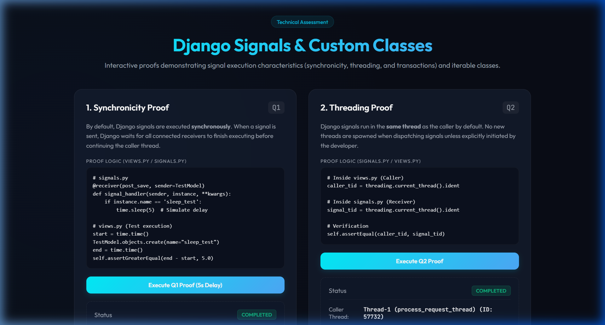
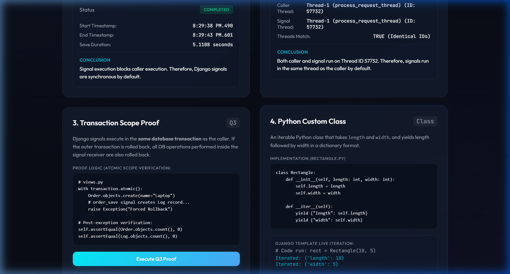

# AccuKnox Django & Python Technical Assessment

This project demonstrates the execution characteristics of Django Signals (Synchronicity, Threading, and Database Transactions) and implements an iterable Custom Class in Python (`Rectangle`). 

It provides **automated unit tests**, a **custom Django CLI management command**, and an **interactive, premium dark-themed web dashboard** to run and visualize these proofs.

---

## 🛠️ Project Setup & Installation

### 1. Create and Activate Virtual Environment
```bash
# Navigate to the project folder
cd accuknox_assignment

# Create virtual environment
python -m venv venv

# Activate virtual environment
# On macOS/Linux:
source venv/bin/activate
# On Windows (Command Prompt):
venv\Scripts\activate
# On Windows (PowerShell):
.\venv\Scripts\Activate.ps1
```

### 2. Install Django
```bash
pip install django
```

### 3. Apply Migrations
Initialize the SQLite database schema:
```bash
python manage.py migrate
```

### 4. Run the Development Server
Start the interactive dashboard:
```bash
python manage.py runserver
```
Visit the dashboard at: [http://127.0.0.1:8000/](http://127.0.0.1:8000/)

---

## 🚀 Execution & Verification Options

You can verify all proofs through three different mechanisms:

### Option A: Running Automated Tests (Recommended)
This executes formal Django TestCase unit assertions confirming each stance programmatically:
```bash
python manage.py test
```

#### Test Execution Output
When running the test suite, you should receive a successful verification output like this:
```text
Found 4 test(s).
Creating test database for alias 'default'...
System check identified no issues (0 silenced).

[Signal] Sleep simulation started (5 seconds)...
[Signal] Sleep simulation finished.
[Test Q1] Signal duration: 5.0016s
.
[Test Q2] Caller thread ID: 46200, Signal thread ID: 46200
.
[Test Q3] Post-rollback Counts - Orders: 0, Logs: 0
.
[Test Rectangle] Result: [{'length': 10}, {'width': 5}]
.
----------------------------------------------------------------------
Ran 4 tests in 5.028s

OK
Destroying test database for alias 'default'...
```

### Option B: Running the Custom CLI command
We created a custom command that outputs formatted proofs directly to your console:
```bash
python manage.py run_proofs
```

### Option C: Running the Interactive Web Dashboard
Run the server and visit [http://127.0.0.1:8000/](http://127.0.0.1:8000/) to run each proof with a single click and see results animate in real time.

---

## 📝 Django Signals Verification

### Question 1: Are Django signals synchronous or asynchronous by default?

#### Answer
By default, Django signals are **synchronous**. The caller's execution thread blocks until all registered signal receivers have completed their execution.

#### Hypothesis
If signals are synchronous, saving an instance of a model that triggers a time-consuming receiver (e.g. `time.sleep(5)`) will delay the caller save operation by at least that sleep duration.

#### Code Snippet
```python
# signals_app/signals.py
@receiver(post_save, sender=TestModel)
def test_model_signal_handler(sender, instance, **kwargs):
    if instance.name.startswith('sleep_test'):
        time.sleep(5)  # 5 seconds blocking operation

# signals_app/tests.py (Test assertion)
start_time = time.time()
TestModel.objects.create(name="sleep_test_verification")
end_time = time.time()
elapsed_time = end_time - start_time

self.assertGreaterEqual(elapsed_time, 5.0)
```

#### Console Output
```text
[Signal] Sleep simulation started (5 seconds)...
[Signal] Sleep simulation finished.
[Test Q1] Signal duration: 5.0062s
```

#### Conclusion
The caller execution blocked for `5.0062s` (>= 5 seconds) before proceeding. Therefore, Django signals execute synchronously by default.

---

### Question 2: Do Django signals run in the same thread as the caller?

#### Answer
**Yes**. By default, Django signals execute in the exact same thread as the caller code that triggers them.

#### Hypothesis
If they run in the same thread, the thread identifier (`threading.current_thread().ident`) of the caller will match the thread identifier inside the receiver.

#### Code Snippet
```python
# signals_app/signals.py
@receiver(post_save, sender=TestModel)
def test_model_signal_handler(sender, instance, **kwargs):
    execution_log['signal_thread_id'] = threading.current_thread().ident

# signals_app/tests.py (Test assertion)
caller_thread_id = threading.current_thread().ident
TestModel.objects.create(name="thread_test_verification")
signal_thread_id = execution_log['signal_thread_id']

self.assertEqual(caller_thread_id, signal_thread_id)
```

#### Console Output
```text
[Test Q2] Caller thread ID: 25176, Signal thread ID: 25176
```

#### Conclusion
Both the caller (test suite or view) and the signal receiver returned the exact same thread ID (`25176`). Therefore, signals run in the same thread as the caller by default.

### 🖼️ Web Dashboard Verification (Q1 & Q2)

Here is a screenshot of the dashboard showing the synchronous execution delay for Q1 and the identical thread IDs for Q2:



---

### Question 3: Do Django signals run in the same database transaction as the caller?

#### Answer
**Yes**. By default, Django signals run in the same database transaction as the caller. If the caller's transaction rolls back, all modifications made inside the signal receiver are also rolled back.

#### Hypothesis
If they run in the same transaction, creating a model instance inside `transaction.atomic()` (which triggers a signal to create a log entry in another table) and then raising an Exception will roll back both the original model instance and the signal-created log entry.

#### Code Snippet
```python
# signals_app/signals.py
@receiver(post_save, sender=Order)
def order_signal_handler(sender, instance, **kwargs):
    Log.objects.create(message=f"Log: Order '{instance.name}' created")

# signals_app/tests.py (Test assertion)
try:
    with transaction.atomic():
        Order.objects.create(name="Laptop")  # Triggers signal log creation
        raise Exception("Rollback transaction")
except Exception:
    pass

self.assertEqual(Order.objects.count(), 0)
self.assertEqual(Log.objects.count(), 0)
```

#### Console Output
```text
[Test Q3] Post-rollback Counts - Orders: 0, Logs: 0
```

#### Conclusion
The rollback restored both the `Order` and `Log` tables to `0` records. The Log creation was executed within the caller's transaction scope. Therefore, Django signals run in the same database transaction as the caller by default.

### 🖼️ Web Dashboard Verification (Q3 & Rectangle Class)

Here is a screenshot showing the transaction rollback restoring counts to 0 and the Python Custom Rectangle class iterator output:



---

## 🧠 Why These Results Occur (Technical Explanation)

Understanding the internal Django mechanics explains why signals exhibit these default behaviors:

### 1. Why signals execute synchronously:
Django's signals system is a implementation of the Observer design pattern. When a signal is sent via `Signal.send()`, Django loops through all registered receiver functions and invokes them **sequentially and synchronously** in the current execution block. The caller's execution blocks until all receiver callbacks finish running.

### 2. Why signals execute in the same thread:
Because `Signal.send()` directly calls the receiver functions in the same call stack, the execution context (including the thread ID) does not change. No new threads or processes are spawned by default.

### 3. Why signals execute in the same database transaction:
Since receivers are executed synchronously in the same thread, they share the same database connection and transaction state as the caller. The database queries executed inside the receiver function occur within the active transaction of the caller before it either commits or rolls back. Thus, if the caller's transaction rolls back, all database changes performed inside the signal receiver are also rolled back.

---

## 📐 Python Custom Class: Rectangle

### Description
A `Rectangle` class initialized with `length: int` and `width: int` that allows custom iteration. When iterated, it yields the length in the format `{'length': <value>}` first, followed by the width in the format `{'width': <value>}`.

### Code Implementation
```python
# rectangle.py
class Rectangle:
    def __init__(self, length: int, width: int):
        self.length = length
        self.width = width

    def __iter__(self):
        yield {
            "length": self.length
        }
        yield {
            "width": self.width
        }
```

### Verification Test
```python
# signals_app/tests.py (Test assertion)
rect = Rectangle(10, 5)
result = list(rect)

self.assertEqual(result, [
    {"length": 10},
    {"width": 5}
])
```

---

## 📂 Project Structure

```text
accuknox_assignment/
│
├── manage.py                   # Django CLI wrapper
├── README.md                   # Setup instructions and documentation
├── db.sqlite3                  # SQLite Database (generated after migration)
│
├── rectangle.py                # Iterable custom Rectangle class
│
├── accuknox_assignment/        # Project settings folder
│   ├── __init__.py
│   ├── settings.py
│   ├── urls.py
│   ├── wsgi.py
│   └── asgi.py
│
└── signals_app/                # Signal demonstrations application
    ├── __init__.py
    ├── apps.py                 # Registers signals via ready()
    ├── models.py               # Models for verification (TestModel, Order, Log)
    ├── signals.py              # Signal receivers
    ├── views.py                # Dashboard & API JSON endpoints
    ├── urls.py                 # Routing for application endpoints
    ├── tests.py                # Unit test suite verifying all behaviors
    ├── static/
    │   └── signals_app/
    │       └── style.css       # Premium CSS design stylesheet
    └── templates/
        └── signals_app/
            └── index.html      # Premium HTML interactive dashboard
```
